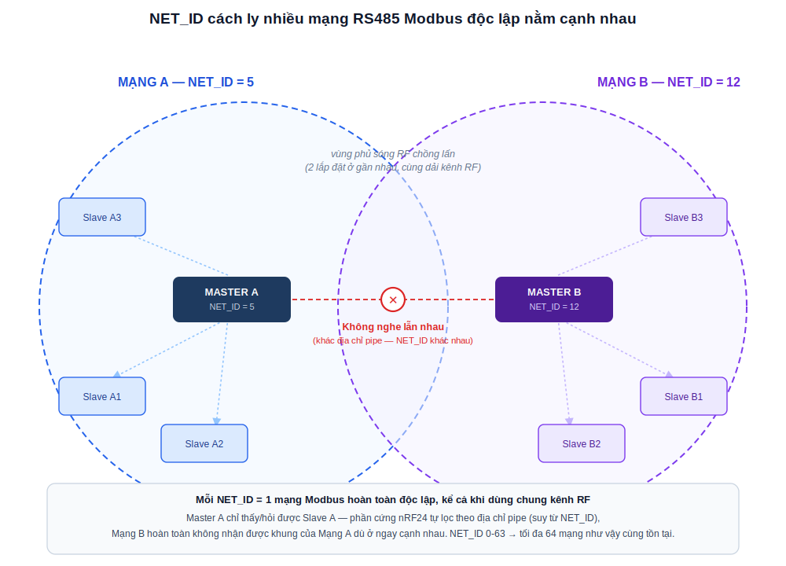
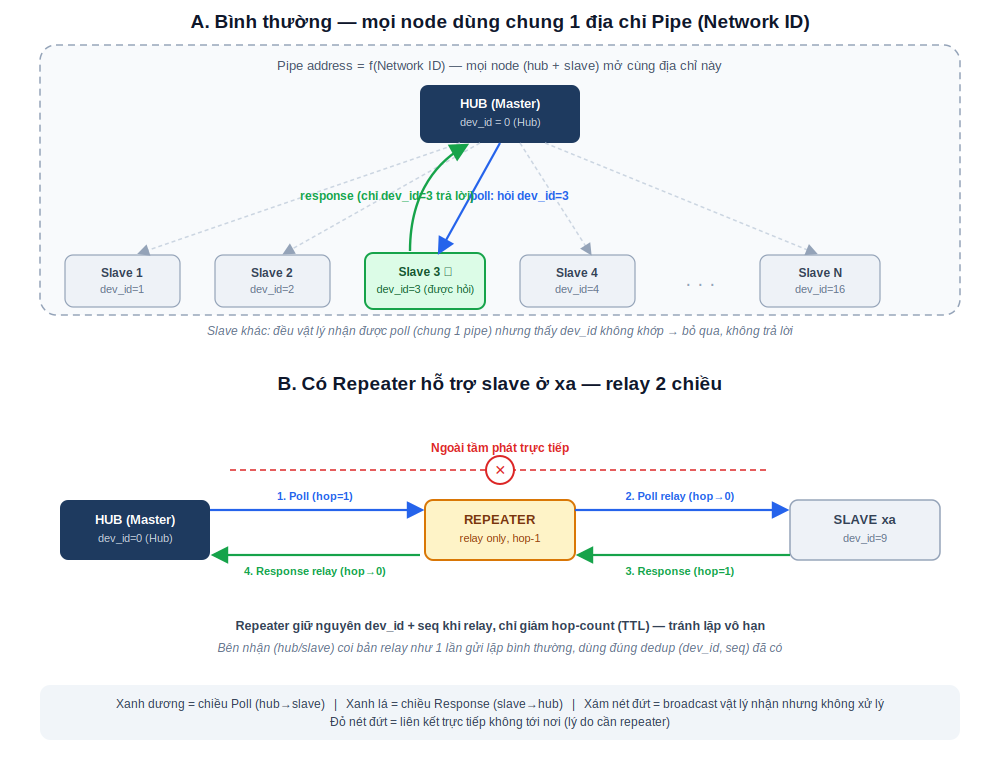
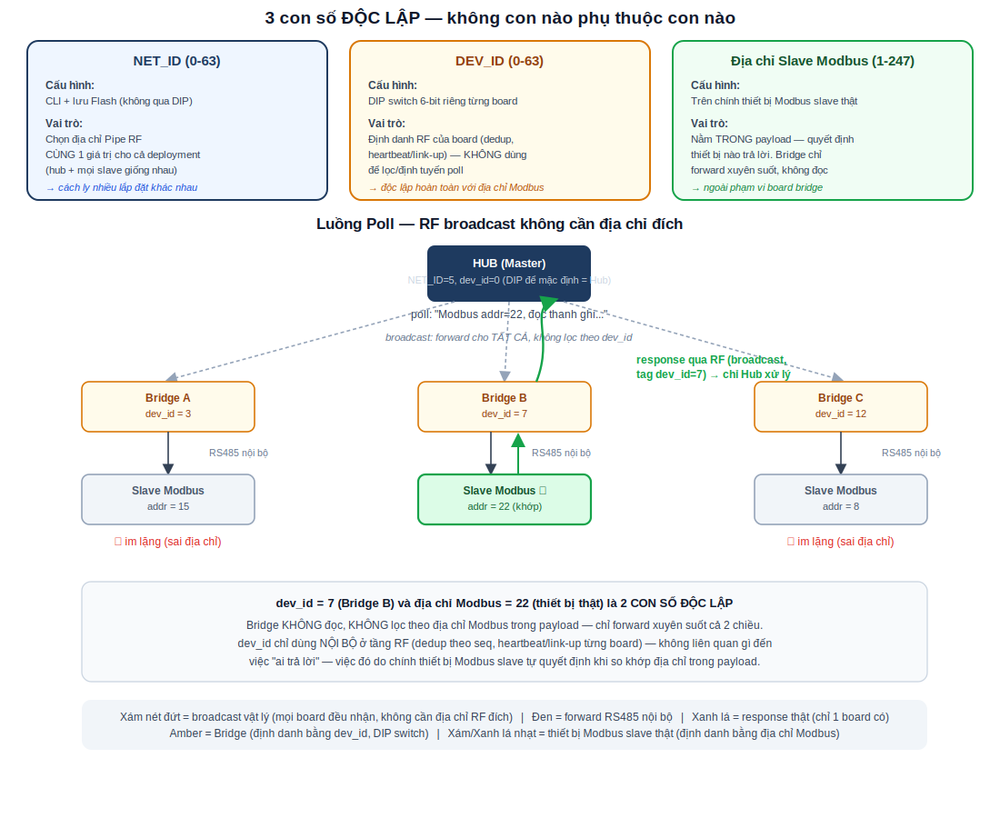
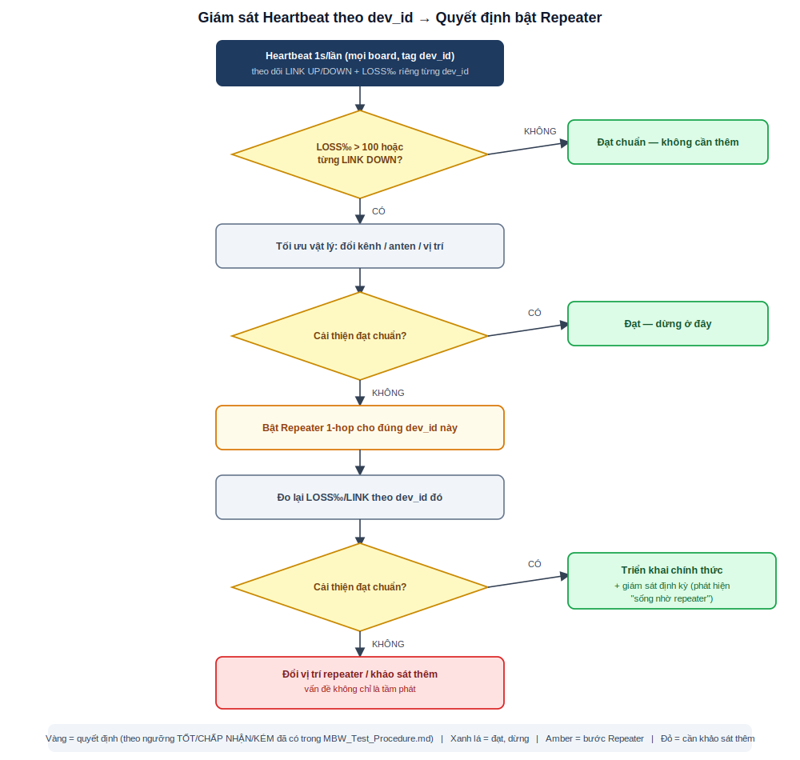

# MBW RF24 RS485 – Định hướng phát triển mạng tới 64 node (Modbus RTU)

> Tổng hợp từ buổi phân tích 2026-07-03/04, dựa trên code thực tế
> (`src/drivers/rf_link.cpp`, `drv_common.h`, `bridge.cpp`) + README. Mục tiêu:
> đánh giá cơ chế mạng RF hiện tại có tối ưu cho triển khai thực tế **1 master
> + 16 slave**, đồng thời đảm bảo kiến trúc **mở rộng được tới tối đa 64
> slave sau này mà không cần thiết kế lại**, so với repeater/mesh, và chốt
> hướng phát triển tiếp theo.

## 1. Bối cảnh thực tế

Topology đang triển khai: **1 hub (master Modbus) ↔ 16 slave** trên tầng
RS485/Modbus RTU — đây là quy mô THỰC TẾ sẽ lắp đặt trước mắt. Yêu cầu quan
trọng: kiến trúc và firmware phải **thiết kế sẵn để mở rộng lên tới tối đa 64
slave sau này** (thêm board mới, không sửa lại code/PCB) chứ không phải xây
riêng cho 16 rồi làm lại từ đầu khi cần mở rộng. Master hỏi tuần tự theo địa
chỉ slave, chỉ đúng slave được hỏi mới trả lời — tại một thời điểm luôn chỉ có
**1 giao dịch đang diễn ra** trên toàn hệ (đặc tính half-duplex sẵn có của
Modbus RTU). Do truyền không dây, có tình trạng rớt frame Modbus xảy ra.

Firmware hỗ trợ tối đa **64 giá trị NET_ID** (0-63), cấu hình qua CLI + Flash
(mục 3.2.b — không qua DIP switch, vì DIP đã dùng riêng cho DEV_ID, mục 3.2.a).
Mỗi NET_ID là một domain broadcast RF riêng (địa chỉ pipe suy từ NET_ID), dùng
để **cách ly nhiều lắp đặt độc lập nằm gần nhau về vật lý** — không liên quan
đến số lượng slave bên trong 1 lắp đặt.

Tài liệu này tập trung vào những gì xảy ra **bên trong 1 NET_ID** — tức 1 mạng
gồm hub (master) + N slave cùng chia sẻ 1 địa chỉ pipe, đúng quy mô thực tế
đang triển khai: **16 slave hiện tại**, thiết kế sẵn để mở rộng tới tối đa
**64 slave** sau này (mục 9) — kiến trúc star/broadcast là đúng hướng cho ca
này, nhưng **bắt buộc sửa nền tảng** ở mục 3 trước khi tối ưu tiếp.

**Định nghĩa lại cho rõ:** NET_ID sinh ra để dành cho trường hợp **nhiều mạng
RS485 khác nhau** (mỗi mạng có Master + các Slave riêng của nó) **nằm cạnh
nhau về mặt vật lý** — ví dụ 2 dây chuyền/tòa nhà khác nhau, mỗi nơi tự lắp 1
bộ Master+Slave riêng, nhưng vị trí lắp đặt đủ gần nhau để vùng phủ sóng RF
chồng lấn. NET_ID (0-63) là thứ duy nhất đảm bảo 2 mạng đó **không nghe lẫn
nhau** dù ở gần nhau và có thể dùng chung dải kênh RF.

*Hình trên — Mạng A (Master A + Slave A1-A3, NET_ID=5) và Mạng B (Master B +
Slave B1-B3, NET_ID=12) lắp gần nhau, vùng phủ sóng RF chồng lấn, nhưng do
khác địa chỉ pipe (suy từ NET_ID khác nhau), phần cứng nRF24 tự lọc — Mạng A
không nhận được khung của Mạng B và ngược lại. Đây chính là mục đích gốc của
NET_ID (khác với DEV_ID — dùng để định danh từng board BÊN TRONG một mạng,
xem mục 3.2). Với 64 giá trị NET_ID, tối đa 64 mạng độc lập như vậy có thể
cùng tồn tại.*

## 2. Cơ chế RF hiện tại (tóm tắt)

- 1 Network ID = 1 địa chỉ pipe broadcast dùng chung cho mọi node trong mạng đó
  (`build_pipe_address()`), không phân biệt hub/slave ở tầng RF.
- Mỗi khung tin `rf_frame_t` mang 1 trường `src_id` — nhưng `src_id` hiện tại
  **được gán bằng chính Network ID** (`s_myid = network_id` trong
  `rf_init()`/`rf_set_network_id()`), KHÔNG phải ID riêng từng thiết bị. Đây là
  gốc rễ của nhiều vấn đề ở mục 3.
- Không auto-ack, không CSMA/listen-before-talk trước khi phát
  (`send_one_frame()` chỉ `stopListening → write → startListening`).
- Tin cậy dựa vào **gửi lặp mù** (2-6 lần, tự tăng/giảm theo `s_redundant_tx`)
  + lọc trùng theo `(src_id, seq)`.
- Heartbeat 1 giây/lần mỗi node, dùng để phát hiện LINK UP/DOWN và tự điều
  chỉnh độ dự phòng.
- Vì Modbus RTU tự nhiên tuần tự (1 giao dịch/lần), thiết kế **không cần**
  CSMA hay tranh chấp kênh phức tạp — đây là lựa chọn hợp lý ban đầu, vẫn giữ
  nguyên.

*Hình trên — Panel A: mọi node (hub + slave) mở cùng 1 địa chỉ pipe theo
Network ID, nên hub broadcast poll thì tất cả vật lý đều nhận được, nhưng chỉ
đúng `dev_id` được hỏi mới xử lý/trả lời, còn lại bỏ qua. Panel B: khi 1 slave
ở ngoài tầm phát trực tiếp, repeater relay cả 2 chiều (poll và response), giữ
nguyên `dev_id`/`seq`, chỉ giảm hop-count.*

## 3. Sửa nền tảng bắt buộc: tách Device ID riêng khỏi Network ID

Đây là điểm quan trọng nhất, cần làm **trước** mọi tối ưu khác (dedup,
redundant-TX, repeater) — vì các cơ chế đó đều dựa trên `src_id` để phân biệt
"ai gửi", trong khi hiện tại `src_id` không làm được việc đó khi có nhiều hơn
1 slave dùng chung Network ID.

### 3.1. Vấn đề gốc rễ

`src_id` = Network ID (`drv_common.h:17` ghi rõ "ID nguon (0-63, lay tu DIP
Network ID)") — nghĩa là **hub và toàn bộ slave trong cùng 1 mạng báo cùng một
`src_id`**, kể cả trong khung heartbeat. Thiết kế này đúng cho mô hình gốc (1
cặp 2 thiết bị, do radio không tự nhận lại tín hiệu mình phát nên "nhận được
gì thì chắc chắn là từ phía kia"), nhưng sai khi có N slave (16 hiện tại, mở
rộng tới 64 sau này) cùng chia sẻ 1 Network ID:

- **Lọc trùng (dedup) có thể làm rớt frame hợp lệ**: bảng dedup chỉ cấp đúng 1
  slot cho toàn bộ N thiết bị (vì cùng `src_id`), slot đó chỉ nhớ 1 giá trị
  `seq` gần nhất. Nếu thiết bị B gửi frame có `seq` trùng giá trị vừa lưu từ
  thiết bị A (dễ xảy ra vì mỗi thiết bị tự đếm `seq` độc lập 0-255), dedup coi
  là "trùng" và **âm thầm loại bỏ frame thật của B** — rớt frame do lỗi logic,
  không liên quan gì đến sóng yếu.
- **Heartbeat/link-up không phân biệt được thiết bị**: `rf_link_peer_id()` /
  log `RF LINK: UP (peer=X)` chỉ luôn hiện đúng Network ID, giống nhau cho mọi
  node — không thể biết chính xác slave nào đang mất kết nối.
- **Redundant-TX tự thích ứng bị "trung bình hóa"**: `s_redundant_tx` toàn cục
  quyết định tăng/giảm dựa trên "trong 1 giây có nghe được gói nào không". Với
  nhiều slave, gần như giây nào cũng có ai đó phát → thuật toán luôn thấy
  "link tốt", không bao giờ tăng dự phòng dù đúng slave xa/yếu đang mất sóng
  nặng.
- **Relay (mục 6) càng che giấu vấn đề**: repeater giữ nguyên `src_id` gốc khi
  phát lại (đúng thiết kế), nhưng vì `src_id` vốn đã không định danh được thiết
  bị, hub không thể biết "LINK UP" là nhờ liên kết trực tiếp hay chỉ nhờ
  repeater đang gánh — tạo cảm giác an toàn giả.

### 3.2. Cơ chế đã chốt: DEV_ID qua DIP switch (độc lập Modbus), NET_ID qua CLI + Flash

Mục này viết ở mức đủ chi tiết để bắt tay sửa firmware và lên kế hoạch thử
nghiệm trực tiếp, không chỉ dừng ở ý tưởng. Đã chốt sau khi cân nhắc các
phương án ở phần thảo luận: DIP switch hiện dùng hết 8/8 bit (SW1-6=NetID,
SW7-8=Baudrate), nên **đổi vai trò SW1-6 từ NetID sang DEV_ID** (không cần
thêm phần cứng), còn NetID (vốn là hằng số chung cho cả deployment, không cần
khác nhau giữa các board) chuyển sang cấu hình qua CLI + Flash.

*Hình trên — 3 con số độc lập: NET_ID chọn pipe (CLI+Flash, giống nhau toàn
deployment), DEV_ID định danh RF từng board (DIP switch, không liên quan
Modbus), địa chỉ Modbus nằm trong payload quyết định thiết bị nào trả lời. RF
broadcast không cần biết địa chỉ đích — mọi bridge đều nhận và forward xuyên
suốt, chỉ đúng thiết bị Modbus khớp địa chỉ mới trả lời.*

#### a) DEV_ID — dùng lại 6 bit DIP hiện có (SW1-6), độc lập với địa chỉ Modbus

- Đổi vai trò `dip_network_id()` (SW1-6, hiện đọc ra 0-63 cho Network ID)
  thành **`dip_dev_id()`** — cùng vị trí vật lý, không cần đổi PCB/BOM, chỉ đổi
  cách firmware diễn giải 6 bit đó.
- **`dev_id` KHÔNG bắt buộc bằng địa chỉ slave Modbus thật** — là 1 số thứ tự
  RF nội bộ (0-63) do kỹ thuật viên set trực tiếp trên DIP lúc lắp đặt, độc
  lập hoàn toàn với địa chỉ Modbus đã cấu hình sẵn trên thiết bị slave thật.
  Kỹ thuật viên cần ghi lại 2 con số cho mỗi vị trí lắp đặt: địa chỉ Modbus
  thật (trên thiết bị slave) + vị trí DIP `dev_id` (trên board bridge) — đổi
  lại, không cần CLI/laptop lúc lắp đặt, nhìn công tắc là biết ngay.
- **`dev_id = 0` (DIP để nguyên mặc định, KHÔNG gạt bit nào) là quy ước nhận
  diện HUB** — không cần build firmware riêng cho hub, không cần CLI/laptop
  để "khai báo vai trò". Mọi board chạy CHUNG 1 firmware, tự đọc `dip_dev_id()`
  lúc boot: đọc ra 0 → board này là Hub (nối vào RS485 của Modbus Master); đọc
  ra 1-63 → board này là Slave với đúng `dev_id` đó. Nhờ vậy lắp đặt hàng loạt
  chỉ cần 1 quy tắc duy nhất: **"board nối vào Master thì để DIP dev_id
  nguyên trạng (0), board nối vào từng slave thì gạt DIP thành 1, 2, 3...
  tương ứng"** — không cần phân biệt trước loại board nào lắp ở đâu.
- Hệ quả: dải `dev_id` dùng cho SLAVE thực tế chỉ còn **1-63 (63 giá trị)**,
  vì 0 đã dành riêng cho Hub — vẫn dư so với 16 slave hiện tại và đủ cho tối
  đa 64 slave dự kiến (chỉ cần bớt 1 xuống 63, không ảnh hưởng thực tế).
- Ràng buộc cần lưu ý khi lắp đặt: 2 board trong cùng 1 NET_ID không được
  trùng `dev_id`, và **phải có đúng 1 board mang `dev_id = 0`** (Hub) — nên có
  lệnh CLI liệt kê các `dev_id` đang nghe thấy trong mạng để dò trùng lặp/thiếu
  Hub lúc nghiệm thu (xem mục f).

#### b) NET_ID — chuyển sang CLI + lưu Flash (không còn qua DIP)

- Thêm lệnh CLI mới **`net id <0-63>`** (và `net id` không tham số để đọc
  lại) — set 1 lần, giống nhau cho TẤT CẢ board trong cùng 1 deployment (hub +
  mọi slave), lưu vào SPI Flash W25Q128 đã có sẵn (`flashmem.cpp`).
- Vì là hằng số chung cho cả deployment, có thể nạp sẵn từ xưởng theo lô/đơn
  hàng (cùng 1 giá trị cho toàn bộ board của 1 khách hàng) thay vì phải nhập
  tay từng board lúc lắp đặt — giảm rủi ro gõ nhầm so với việc từng kỹ thuật
  viên tự set NET_ID trên từng board riêng lẻ.
- Giá trị mặc định khi CHƯA cấu hình: sentinel riêng (ví dụ `0xFF`) — cảnh báo
  rõ trên console nếu board chạy với NET_ID chưa gán.
- `rf_init()` đọc NET_ID từ Flash thay vì từ `dip_network_id()` như hiện tại.

#### c) Đã cân nhắc và loại bỏ: tự động dò dev_id từ khung Modbus đi qua

Trước đó có đề xuất suy luận `dev_id` từ byte địa chỉ Modbus trong khung
response đi qua — phương án này **không còn phù hợp** sau khi chốt dev_id độc
lập với Modbus (mục a): mục tiêu ban đầu của việc "tự dò" là để `dev_id` =
địa chỉ Modbus thật mà không cần thêm bước cấu hình; nay `dev_id` đã có DIP
switch trực tiếp và không cần bằng địa chỉ Modbus nữa, nên bỏ hẳn phương án
suy luận từ traffic — vừa đơn giản hơn, vừa tránh các rủi ro đã nêu trước đó
(chưa xác định được `dev_id` trong lúc đầu, sai nếu 1 board bridge nhiều hơn 1
slave).

#### d) Thay đổi cấu trúc khung tin (`drv_common.h`)

- Thêm 1 byte `dev_id` vào `rf_frame_t`. Khuyến nghị **bỏ hẳn trường `src_id`
  cũ**, dùng lại đúng vị trí đó cho `dev_id` — vì thông tin NET_ID đã ẩn sẵn
  trong chính địa chỉ pipe (mọi khung nhận được trên 1 pipe chắc chắn cùng
  NET_ID, không cần lặp lại trong payload), nên không tăng thêm kích thước
  khung, không đổi `RF_HDR_LEN`/`RF_CHUNK_MAX`.
- CRC16 không đổi cách tính, chỉ đổi ý nghĩa của trường đầu tiên trong header.

#### e) Các hàm cần sửa (danh sách cụ thể để bắt tay code)

| Hàm/biến | Thay đổi |
|---|---|
| `dipsw.cpp`: `dip_network_id()` | Đổi thành `dip_dev_id()` — cùng 6 bit SW1-6, đổi tên và ý nghĩa |
| `mbw_drv.cpp` (`drv_init`) | Đọc NET_ID từ Flash (hàm mới, mục b) thay vì `dip_network_id()`; đọc `dev_id` từ `dip_dev_id()` cho MỌI board như nhau — KHÔNG có nhánh code riêng cho hub, `dev_id == 0` tự nhiên là quy ước Hub |
| `rf_init()` | Nhận thêm tham số `dev_id`; gán vào biến toàn cục mới `s_dev_id` |
| `rf_send()`, `send_heartbeat_frame()` | Gán `frame.dev_id = s_dev_id` thay vì `frame.src_id = s_myid` |
| `dedup_check_and_update()` | Khóa theo `(dev_id, seq)` thay vì `(src_id, seq)` |
| `reasm_reset()` / `handle_frame()` | So khớp nguồn đang ghép mảnh theo `dev_id` |
| `note_link_alive()`, `s_peer_id` | Theo `dev_id`; chuyển sang mảng nhỏ theo `dev_id` (mục 3.3) |
| Mới: `net_set_id(uint8_t id)`, `net_get_id()` | Đọc/ghi NET_ID trên Flash, gọi từ CLI `net id` |
| CLI (`hal.cpp`) | Thêm `net id <n>` / `net id` (đọc); thêm lệnh liệt kê các `dev_id` đang nghe thấy trong mạng (dò trùng lặp lúc nghiệm thu) |

#### f) Kế hoạch thử nghiệm để xác nhận cơ chế hoạt động đúng

| Bước test | Nội dung | Tiêu chí đạt |
|---|---|---|
| T0 (mới, trước T1 hiện có) | Xác nhận mọi board trong 1 deployment có CÙNG NET_ID (đọc qua `net id`); đúng 1 board có `dev_id=0` (Hub, DIP để mặc định); các board còn lại `dev_id` 1-63 không trùng nhau | NET_ID đồng nhất 100%, đúng 1 Hub, không trùng `dev_id` |
| Hồi quy dedup | Dựng ≥3 board cùng NET_ID, ép `seq` cố ý trùng giữa các board, xác nhận KHÔNG còn rớt frame chéo giữa các `dev_id` khác nhau (bug mô tả ở mục 3.1) | 0 frame hợp lệ bị dedup sai loại bỏ |
| Heartbeat/link theo `dev_id` | Tắt nguồn lần lượt từng slave, xác nhận log/CLI báo đúng `dev_id` bị mất kết nối, không lẫn sang thiết bị khác | Đúng 100% theo thiết bị vừa tắt |
| Hồi quy T1-T4 | Chạy lại toàn bộ quy trình hiện có (`MBW_Test_Procedure.md`) trên cấu trúc khung mới | Đạt như tiêu chí đã định nghĩa trong quy trình, không phát sinh lỗi CRC/rớt do đổi cấu trúc khung |

### 3.3. Tác động sau khi sửa

| Cơ chế | Trước (dùng Network ID làm src_id) | Sau (DEV_ID qua DIP, độc lập Modbus; NET_ID qua CLI+Flash) |
|---|---|---|
| Dedup | 1 slot dùng chung cho N thiết bị, dễ lọt/rớt frame sai | Mỗi thiết bị 1 slot riêng theo `(dev_id, seq)` — khuyến nghị đặt cố định `DEDUP_SLOTS = 68` (đủ cho tối đa 64 thiết bị + biên an toàn) ngay từ đầu, dù triển khai hiện tại chỉ 16 thiết bị: chi phí RAM thêm chỉ ~136 byte, tránh phải sửa lại kích thước mảng khi lắp thêm slave sau này |
| Heartbeat/Link-up | 1 biến toàn cục `s_peer_id`/`s_link_up`, không biết ai còn/mất sóng | Mảng **cố định 64 phần tử** theo `dev_id` (64 x 4 byte ≈ 256 byte RAM) lưu "lần nghe cuối" từng thiết bị — thiết kế sẵn cho tối đa 64 dù hiện tại chỉ dùng 16 phần tử đầu, biết chính xác slave nào đang DOWN mà không cần đổi code khi mở rộng |
| Redundant-TX tự thích ứng | Trung bình hóa toàn mạng, không nhắm đúng slave yếu | Có thể tính riêng theo `dev_id` một khi đã có state riêng — hoặc đơn giản hơn: bỏ auto-adapt toàn cục, dùng giá trị cố định đã kiểm chứng qua bench test, để Modbus timeout/retry xử lý phần còn lại |
| Repeater (mục 6) | Không phân biệt được relay che giấu link chết hay link thật sống | Biết chính xác slave nào chỉ "sống" nhờ repeater — cảnh báo đúng thực trạng link vật lý |

## 4. Các điểm khác cần vá

### 4.1. Không có xác nhận (ACK) ở tầng RF

Thiết kế tắt hẳn auto-ack phần cứng vì nghĩ đây là kênh broadcast nhiều máy
cùng nghe. Nhưng vì Modbus RTU vốn tuần tự, tại một thời điểm giao dịch RF
thực chất luôn là 1-1 (đúng 1 slave đang trả lời), chỉ dùng chung địa chỉ pipe
để tiện quản lý NetID. Có thể cân nhắc bật **auto-ack phần cứng nRF24**
(ShockBurst ACK + retry) thay cho gửi lặp mù cố định — retry đúng số lần cần
theo từng liên kết cụ thể, hiệu quả băng thông hơn hẳn so với gửi lặp đều 2-6
lần cho mọi node bất kể gần/xa.

→ **Đề xuất:** thử nghiệm có kiểm soát (không đổi ngay production) — bật
auto-ack trên bench test 2-3 board, đo tỷ lệ giao dịch mất & CRC lỗi so với
cơ chế redundant hiện tại trước khi quyết định đổi. Nên làm **sau** khi đã có
Device ID riêng (mục 3), vì lúc đó mới đo được chính xác link từng thiết bị để
so sánh trước/sau.

## 5. So sánh Star/Broadcast hiện tại vs Repeater vs Mesh

| Tiêu chí | Star/Broadcast (hiện tại) | Repeater 1-hop | Mesh (RF24Network/Mesh) |
|---|---|---|---|
| Phù hợp với Modbus tuần tự (1 giao dịch/lần) | Có — tận dụng đúng đặc tính | Có, nếu chỉ cần nối dài tầm phát | Thừa — không có nhu cầu định tuyến đa hop giữa các slave |
| Giải quyết vấn đề gì | Độ tin cậy trong tầm phủ RF | **Tầm phát** (slave ở xa/khuất hub) | Định tuyến đa hop tùy ý topology |
| Chi phí RAM (chip 10KB, ~4KB dành cho FreeRTOS) | Thấp (đã chạy) | Thấp — chỉ thêm 1 byte hop-count/TTL vào khung, không cần bảng định tuyến | Cao — bảng định tuyến cho tới 64 node khó vừa ngân sách RAM hiện tại |
| Độ trễ | Thấp (1 hop) | Trung bình (1 hop lặp lại) | Cao, khó lường (nhiều hop) — dễ vượt timeout Modbus master (thường ~1s) |
| Khi nào cần | Mặc định | Chỉ khi có slave thực sự ngoài tầm phát trực tiếp từ hub | Chỉ khi topology thực sự cần tự định tuyến đa hop, không phải trường hợp này |

**Kết luận kiến trúc:** giữ **star/broadcast**, không chuyển sang mesh. Chỉ bổ
sung **repeater 1-hop đơn giản** (không bảng định tuyến, chỉ relay 1 lần kèm
TTL/hop-count để tránh lặp vô hạn) cho các slave xác nhận nằm ngoài tầm phát
trực tiếp — đây là vấn đề tầm phát, không phải vấn đề kiến trúc mạng.

## 6. Thiết kế cơ chế Repeater 1-hop

Repeater relay **cả 2 chiều truyền**, không chỉ chiều slave→hub:

- **Chiều hub→slave (poll):** nếu slave ở xa không nhận trực tiếp được lệnh
  hỏi từ hub, node repeater (đứng giữa) nghe được poll của hub sẽ phát lại để
  slave xa nhận được và trả lời.
- **Chiều slave→hub (response):** ngược lại, nếu response của slave xa không
  tới được hub trực tiếp, repeater nghe được response đó và phát lại cho hub.

Vì cùng 1 khung `rf_frame_t` broadcast dùng chung 1 địa chỉ pipe cho mọi node
(hub lẫn slave), cơ chế repeat áp dụng **đối xứng cho mọi nguồn** — repeater
không cần biết frame đến từ hub hay từ slave, chỉ cần relay đúng luật dưới
đây.

### Nguyên tắc thiết kế

1. **Giữ nguyên `dev_id`/`seq` gốc khi relay** (sau khi đã áp dụng mục 3 —
   trước đó là `src_id`). Repeater KHÔNG đổi định danh nguồn — nhờ vậy bên
   nhận (hub hoặc slave) coi bản relay như một lần "gửi lặp" bình thường, dùng
   đúng cơ chế lọc trùng đã có sẵn, không cần sửa gì thêm ở phía hub/slave.
2. **Thêm 1 byte hop-count/TTL vào `rf_frame_t`.** Mỗi lần relay giảm 1; hết
   hop (khuyến nghị giới hạn tối đa 1 hop cho ca dùng này) thì không relay
   tiếp — bắt buộc để tránh lặp vô hạn khi nhiều repeater cùng nghe nhau.
3. **Repeater chỉ relay bản đầu tiên nghe được của mỗi `(dev_id, seq)`**,
   dùng lại chính bảng dedup hiện có (đổi mục đích: không phải để loại bỏ mà
   để biết "đã relay rồi, đừng relay lại"). Nếu bỏ qua bước này, node gốc đã
   tự gửi lặp 2-6 lần (redundant TX), repeater sẽ nhân relay thêm 2-6 lần nữa
   → chiếm kênh gấp bội, phản tác dụng.
4. **Vai trò repeater gán cố định cho 1 (vài) board cụ thể**, đặt ở vị trí
   trung gian giữa hub và các slave xa. KHÔNG để mọi slave tự động relay mọi
   thứ nghe được — nếu không sẽ gây "broadcast storm" khi nhiều slave cùng
   relay lẫn nhau.
5. **Không cần bảng định tuyến/địa chỉ đích.** Repeater phát lại mù trên cùng
   kênh/địa chỉ sau khi qua bước 2-3, giữ đúng tinh thần đơn giản/nhẹ RAM của
   thiết kế hiện tại (phù hợp ngân sách 10KB RAM của STM32L151C8T6).

### Cách bật chế độ Repeater trên 1 board

DIP switch đã dùng hết 8/8 bit (6 bit `dev_id` + 2 bit Baudrate, mục 3.2.a) —
**không còn bit trống** để làm 1 công tắc "repeater on/off" riêng. Board vẫn
giữ nguyên `dev_id` đã set (không cần đổi gì trên DIP khi trở thành repeater);
cần thêm 1 cờ boolean riêng (`is_repeater`, lưu Flash) để bật/tắt, qua 2 cách:

1. **CLI `rf repeater on|off` (khuyến nghị chính)** — vì quyết định bật
   repeater luôn đến SAU bước đo `rf stat`/khảo sát thực địa (mục 7.3, đã cần
   laptop để đọc số liệu LOSS‰ rồi), nên thêm 1 lệnh CLI ngay trong cùng
   phiên làm việc đó không phát sinh thao tác mới. `rf repeater` (không tham
   số) để đọc lại trạng thái đang lưu. Lưu vào Flash (giống NET_ID, mục 3.2.b)
   để giữ qua các lần mất nguồn.
2. **Giữ nút nhấn S2 có sẵn trên board (tuỳ chọn, không cần laptop)** — board
   đã có sẵn nút S2 (`PA11`, `btn_is_pressed()` trong `ledbuzz.cpp`) dùng cho
   mục đích khác (hiện tại chưa gán chức năng cụ thể); có thể tận dụng: giữ
   nút S2 liên tục 3-5 giây lúc board đang chạy để **toggle** `is_repeater`,
   xác nhận bằng LED_LIFE nháy nhanh 3 lần + `buzzer_beep()` 1 tiếng dài khi
   BẬT, 1 tiếng ngắn khi TẮT — không tốn thêm bit DIP, không cần CLI, phù hợp
   khi kỹ thuật viên cần bật nhanh tại hiện trường mà không mang laptop. Cần
   code thêm phần đếm thời gian giữ nút trong `btn_process()` (hiện chỉ in
   `BTN: DOWN/UP`, chưa có logic giữ-lâu).

Dù bật bằng cách nào, chỉ nên có **đúng 1 board** làm repeater cho 1 khu vực
tại 1 thời điểm (theo nguyên tắc 4 ở trên) — nên vẫn cần lệnh liệt kê `dev_id`
đang có (mục 3.2.a) để kiểm tra không vô tình bật trùng 2 repeater cùng lúc.

### Đánh đổi cần chấp nhận

- Thêm ~1 hop độ trễ mỗi chiều (poll và response đều có thể qua repeater) —
  vẫn cần nằm trong ngưỡng timeout Modbus master (khuyến nghị 1000-1500ms
  theo `MBW_Test_Procedure.md`), nên **tăng timeout khi bật repeater** để có
  biên an toàn.
- Repeater không có ACK nên không biết trước link trực tiếp đã đủ tốt hay
  chưa — có thể relay cả khi không thực sự cần, tốn thêm ít băng thông
  nhưng chấp nhận được vì lưu lượng tổng thể vẫn thấp (Modbus tuần tự).
- Sau khi có Device ID riêng (mục 3), có thể biết chính xác slave nào đang
  "sống nhờ repeater" thay vì link trực tiếp — nên theo dõi chỉ số này định kỳ
  để phát hiện sớm nếu link trực tiếp tiếp tục xấu đi.

## 7. Giám sát Heartbeat theo dev_id, kiểm tra rớt gói RF & quyết định bật Repeater

### 7.1. Cơ chế Heartbeat (sau khi có dev_id riêng)

Mỗi board tự phát 1 khung heartbeat mỗi giây (`RF_HB_PERIOD_MS = 1000ms`),
tách biệt hoàn toàn dữ liệu Modbus thật (dùng `frag_idx = 0xFF` làm sentinel,
không thể trùng khung dữ liệu thật). Sau khi tách `dev_id` khỏi Network ID
(mục 3), việc theo dõi heartbeat chuyển từ 1 biến toàn cục sang **theo dõi
riêng từng `dev_id`**:

- **LINK UP** (theo từng `dev_id`): bất kỳ khung hợp lệ nào (heartbeat hoặc dữ
  liệu Modbus thật) nhận được từ đúng `dev_id` đó trong `RF_LINK_TIMEOUT_MS`
  (3 giây, ~3 chu kỳ heartbeat) gần nhất.
- **LINK DOWN** (theo từng `dev_id`): quá 3 giây không nhận được gì từ đúng
  `dev_id` đó — log riêng biệt từng thiết bị, ví dụ `RF LINK: DOWN (dev_id=7,
  2400ms...)`, thay vì chỉ 1 dòng log chung cho cả mạng như hiện tại.
- Độ dự phòng (redundant TX) có thể tiếp tục để cố định (mục 3.3/4.1) thay vì
  auto-adapt toàn cục, vì auto-adapt theo từng `dev_id` cần thêm state/RAM và
  nên làm sau khi đã có số liệu thực tế xác nhận có cần thiết hay không.

### 7.2. Kiểm tra rớt gói tin RF

Các chỉ số đã có sẵn trong firmware, nhưng hiện tính **gộp toàn mạng** — cần
tách theo `dev_id` để biết chính xác thiết bị nào đang rớt gói:

| Chỉ số hiện có | Hàm/lệnh | Cần đổi thành |
|---|---|---|
| TX / RX OK / RX trùng / CRC lỗi / rớt mảnh | `rf_get_stats()`, CLI `rf stat` | Tách theo `dev_id` (mảng nhỏ thay vì biến đơn) |
| % mất heartbeat (LOSS_PROMILLE) | `rf_get_loss_permille()` | Tính riêng theo từng `dev_id` (lý do: mục 3.1 — hiện bị "trung bình hóa" sai) |
| LINK UP/DOWN | `rf_link_up()`, `rf_link_peer_id()` | Theo `dev_id` (mục 7.1) |
| Ngưỡng đánh giá TỐT/CHẤP NHẬN/KÉM | `MBW_Test_Procedure.md` (LOSS <2%/2-10%/>10%, REDUND ≤3x/4-5x/≥6x, LỖI giao dịch ≤1%/1-2%/>2%) | Áp dụng nguyên các ngưỡng này, chỉ đổi cách đo — theo từng `dev_id` thay vì gộp |

Đề xuất thêm lệnh CLI **`rf stat <dev_id>`** để xem riêng số liệu 1 thiết bị
cụ thể, và **`rf stat all`** để liệt kê nhanh toàn bộ `dev_id` đang có LOSS‰
hoặc trạng thái DOWN — phục vụ trực tiếp khảo sát T3/T4 trên 16 thiết bị hiện
tại, và vẫn dùng được nguyên khi mở rộng tới 64 sau này, không cần đứng cạnh
từng board.

### 7.3. Quy trình quyết định bật Repeater cho thiết bị ở xa

*Hình trên — sau khi có heartbeat/LOSS‰ theo từng `dev_id` (mục 7.1-7.2), quy
trình quyết định đi qua 2 lớp lọc trước khi chấp nhận dùng repeater: (1) tối
ưu vật lý trước (kênh/anten/vị trí, bảng "Xử lý khi không đạt" đã có trong
`MBW_Test_Procedure.md`), chỉ khi vẫn không cải thiện mới (2) bật repeater
1-hop (mục 6) cho ĐÚNG thiết bị đó, đo lại, và giám sát định kỳ sau khi triển
khai chính thức — vì repeater không có ACK nên cần theo dõi liên tục xem thiết
bị có đang "sống nhờ repeater" hay không (mục 6, phần "Đánh đổi cần chấp
nhận").*

Lưu ý quan trọng: bước tối ưu vật lý (nhánh giữa) **phải làm trước** khi bật
repeater — bật repeater ngay khi thấy LOSS‰ cao có thể che giấu một vấn đề dễ
sửa hơn (ví dụ đơn giản là kênh RF đang trùng nguồn nhiễu, hoặc anten lắp sai
hướng), khiến hệ thống phức tạp hơn mức cần thiết.

## 8. Lộ trình đề xuất

| Bước                               | Nội dung                                                                                                                                                                                  | Rủi ro/chi phí                                                                              |
| ---------------------------------- | ----------------------------------------------------------------------------------------------------------------------------------------------------------------------------------------- | ------------------------------------------------------------------------------------------- |
| 1                                  | **Ưu tiên cao nhất:** thêm lệnh CLI `modbus id <n>` + lưu Flash, thêm `dev_id` vào `rf_frame_t`, tách khỏi Network ID (mục 3.2) — chạy T0 (mục 3.2.e) trước khi qua bước 2                | Trung bình — đổi cấu trúc khung, cần đồng bộ cả hub/slave, test hồi quy CRC/dedup/heartbeat |
| 2                                  | Đặt cố định `DEDUP_SLOTS = 68` (đủ cho tối đa 64 thiết bị, dùng ngay từ đầu dù hiện tại chỉ lắp 16) — tránh phải sửa lại kích thước mảng khi mở rộng sau này                              | Thấp, chỉ tốn thêm ~136 byte RAM                                                            |
| 3                                  | Chuyển heartbeat/link-up sang theo dõi riêng từng `dev_id`                                                                                                                                | Trung bình — thêm mảng state nhỏ, sửa `note_link_alive`/`rf_link_peer_id`                   |
| 4                                  | Đo thực tế bằng T3/T4 (`docs/MBW_Test_Procedure.md`) trên toàn bộ slave, xác định slave/khu vực nào rớt nhiều nhất — lúc này số liệu đã đáng tin vì không còn lẫn lỗi dedup do Network ID | Không đổi code, chỉ đo                                                                      |
| 5                                  | Với slave rớt nhiều do khoảng cách/vật cản → xử lý vật lý trước (kênh, anten, vị trí) theo bảng "Xử lý khi không đạt" đã có                                                               | Thấp                                                                                        |
| 6                                  | Nếu vẫn còn slave ngoài tầm sau bước 5 → thêm field hop-count vào `rf_frame_t`, cài `rf repeater on` cho board trung gian, relay 2 chiều theo mục 6                                       | Trung bình — cần test kỹ chống lặp gói + đo lại timeout Modbus                              |
| 7 (tuỳ chọn, cần bench test riêng) | Thử nghiệm auto-ack phần cứng thay redundant TX mù, so sánh số liệu trước khi đổi production                                                                                              | Trung bình — thay đổi tầng RF, cần hồi quy đầy đủ theo quy trình T1-T4                      |

## 9. Thiết kế mở rộng: 16 slave hiện tại → tối đa 64 slave sau này

Nguyên tắc xuyên suốt: **triển khai thực tế trước mắt là 1 master + 16
slave**, nhưng mọi cấu trúc dữ liệu/firmware phải **thiết kế sẵn cho quy mô 64
ngay từ đầu**, để khi khách hàng lắp thêm slave (16 → 64) chỉ cần cắm thêm
board mới (set `dev_id` DIP chưa dùng), **không cần nạp lại firmware mới hay
sửa code**.

| Thành phần | Thiết kế cho 16 (hiện tại) | Đã sẵn sàng cho 64 (sau này) như thế nào |
|---|---|---|
| DEV_ID (DIP switch, mục 3.2.a) | Set 16 board đầu với `dev_id` 1-16 (tuỳ chọn) | 6 bit DIP vốn đã hỗ trợ 0-63 — chỉ cần set thêm board mới với `dev_id` chưa dùng, không đổi firmware/PCB |
| NET_ID (CLI+Flash, mục 3.2.b) | Set 1 lần, giống nhau cho hub + 16 slave | Board mới cùng deployment chỉ cần set đúng NET_ID hiện có — không liên quan số lượng thiết bị |
| `DEDUP_SLOTS` (mục 3.3, 8) | Chỉ cần 16 slot là đủ, nhưng khuyến nghị đặt cố định **68** ngay từ đầu | Đã đủ cho 64 thiết bị, không cần build lại firmware khi mở rộng |
| Mảng heartbeat/link-up theo `dev_id` (mục 3.3, 7.1) | Chỉ 16 phần tử đang hoạt động | Đặt cố định mảng 64 phần tử ngay từ đầu (mục 3.3) — 48 phần tử còn lại chỉ đơn giản chưa có dữ liệu, không tốn thêm công sửa code |
| Redundant-TX | Cố định 1 giá trị đã kiểm chứng qua bench test ở quy mô 16 | Cần **đo lại** khi mở rộng lên 64 (xem lưu ý tải heartbeat bên dưới) — không giả định số liệu ở 16 vẫn đúng nguyên tại 64 |
| Repeater (mục 6, 7.3) | Áp dụng quy trình quyết định mục 7.3 cho 16 slave hiện tại | Khi mở rộng, phạm vi lắp đặt có thể rộng hơn — chạy lại đúng quy trình 7.3 cho từng slave mới, không giả định slave mới chắc chắn trong tầm |

**Lưu ý riêng về tải heartbeat khi mở rộng:** mỗi thiết bị tự phát heartbeat
1 lần/giây (mục 7.1). Ở 16 thiết bị, tải heartbeat nền khoảng 16-32 gói/giây
(tính cả gửi lặp 2 lần/heartbeat); ở 64 thiết bị, con số này tăng lên khoảng
64-128 gói/giây — vẫn nhỏ so với băng thông 250kbps nhưng **cần đo lại thực
tế ở quy mô 64** (không suy diễn tuyến tính từ số liệu 16 thiết bị), đặc biệt
nếu lúc đó vẫn còn dùng redundant-TX tự thích ứng toàn cục (mục 3.1) thay vì
đã chuyển sang giá trị cố định/theo từng `dev_id`.

**Tóm lại:** không có bước "làm lại kiến trúc" nào cần thiết khi đi từ 16 lên
64 — miễn là các bước ở mục 3 (Device ID) và việc đặt cố định kích thước mảng
theo 64 (thay vì theo đúng 16) được làm ngay từ vòng phát triển đầu tiên.

## 10. Điểm cần xác nhận thêm

- Đã quyết định cơ chế xác định `dev_id`: DIP switch (6 bit SW1-6, đổi vai trò
  từ NetID cũ) + độc lập với địa chỉ Modbus (mục 3.2.a); NET_ID chuyển sang
  CLI `net id <n>` + lưu Flash (mục 3.2.b). Cần xác nhận thêm: quy trình lắp
  đặt thực tế có công cụ hỗ trợ đọc nhanh `dev_id` đang set trên nhiều board
  cùng lúc hay không (qua `mbw_test_app.py`), để dò trùng lặp lúc nghiệm thu —
  cả ở 16 board hiện tại lẫn khi mở rộng tới 64 sau này.
- Đã xác nhận quy mô: **1 master + 16 slave triển khai trước mắt**, kiến trúc
  thiết kế sẵn cho tối đa 64 slave (mục 9). Cần biết thêm: mốc thời gian dự
  kiến mở rộng (nếu có), để ưu tiên đúng mức việc "đo lại tải heartbeat ở quy
  mô 64" (mục 9) trong lộ trình.
- Có slave nào trong 16 slave hiện tại đã biết trước là ở xa/khuất hub (ứng
  viên cho repeater, mục 7.3) hay chưa khảo sát thực địa.
- Timeout/retry hiện tại của Modbus master (khuyến nghị tối thiểu 1000-1500ms
  theo `MBW_Test_Procedure.md`) — vẫn là lớp bảo vệ cuối cùng khi RF rớt frame
  ngẫu nhiên, không nên kỳ vọng lớp RF tin cậy 100%.
